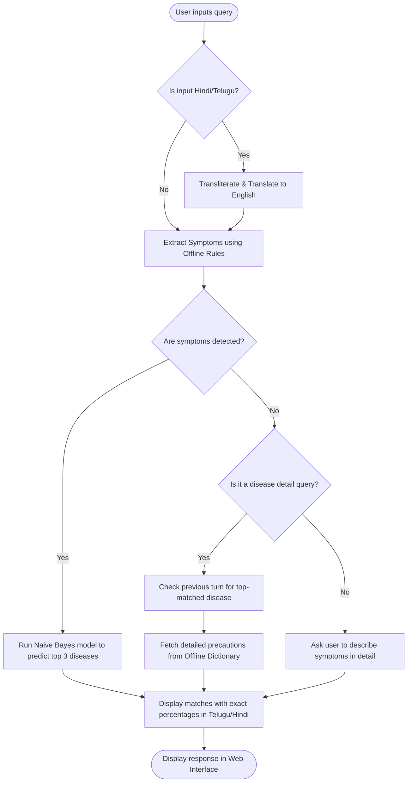

# AYUMITHRA HEALTH CHATBOT - TECHNICAL PROJECT REPORT
<!--
PDF EXPORT FORMATTING COMPLIANCE INSTRUCTIONS:
- Font: Times New Roman
- Main text size: 12pt (Justified)
- Line Spacing: 1.5 throughout, Paragraph space-6 point.
- Margins: Top: 1", Bottom: 1", Right: 1", Left: 1.5"
- Header: "AyuMithra Health Chatbot" (Top Right, Size 10)
- Footer: "Dept. of CSE, MVSREC(A)" (Left Side, Size 10) | "Page Number" (Right Side, Size 10)
-->

---

<p align="center"><b>A Theme Based Project Report</b></p>
<p align="center"><b>on</b></p>
<p align="center"><b>AYUMITHRA - A MULTILINGUAL OFFLINE CONVERSATIONAL AI HEALTH CHATBOT</b></p>

\
<p align="center">Submitted for partial fulfilment of the requirements for the award of the degree of</p>
<p align="center"><b>BACHELOR OF ENGINEERING</b></p>
<p align="center">in</p>
<p align="center"><b>COMPUTER SCIENCE AND ENGINEERING</b></p>

\
<p align="center"><b>By</b></p>
<p align="center"><b>K.S. Swathi (2451-23-750-044)</b></p>
<p align="center"><b>Y. Samuel Dan (2451-23-750-047)</b></p>
<p align="center"><b>N. Sharanya (2451-23-750-051)</b></p>

\
<p align="center"><b>Under the guidance of</b></p>
<p align="center"><b>N. Sandhya Rani</b></p>
<p align="center"><b>Assistant Professor, Dept. of CSE, MVSRC</b></p>

\
<p align="center">[Insert MVSR College Logo Here]</p>

<p align="center"><b>MATURI VENKATA SUBBA RAO (MVSR) ENGINEERING COLLEGE</b></p>
<p align="center"><b>(An Autonomous Institution)</b></p>
<p align="center"><b>Department of Computer Science and Engineering</b></p>
<p align="center"><b>(Affiliated to Osmania University & Recognized by AICTE)</b></p>
<p align="center"><b>Nadergul, Balapur Mandal, Hyderabad – 501 510</b></p>
<p align="center"><b>Academic Year: 2025-2026</b></p>

---

<p align="center"><b>MATURI VENKATA SUBBA RAO (MVSR) ENGINEERING COLLEGE</b></p>
<p align="center"><b>(An Autonomous Institution)</b></p>
<p align="center"><b>Department of Computer Science and Engineering</b></p>
<p align="center"><b>(Affiliated to Osmania University & Recognized by AICTE)</b></p>
<p align="center"><b>Nadergul, Balapur Mandal, Hyderabad – 501 510</b></p>

\
<p align="center">[Insert MVSR College Logo Here]</p>

<p align="center"><b>CERTIFICATE</b></p>

This is to certify that the Theme Based project work entitled **"AYUMITHRA"** is a bonafide work carried out by **K.S. Swathi (2451-23-750-044), Y. Samuel Dan (2451-23-750-047), and N. Sharanya (2451-23-750-051)** in partial fulfilment of the requirements for the award of degree of **Bachelor of Engineering in Computer Science and Engineering** from **Maturi Venkata Subba Rao (MVSR) Engineering College**, affiliated to **OSMANIA UNIVERSITY**, Hyderabad, during the Academic Year **2025-2026**, under our guidance and supervision.

The results embodied in this report have not been submitted to any other university or institute for the award of any degree or diploma.

\
\
**Internal Guide**:  
N. Sandhya Rani, Assistant Professor, Dept. of CSE, MVSRC  

\
\
**Project Coordinators**:  
1. N. Sandhya  
2. K. Ascherya  
3. Neeraj Sharma  

\
\
**Head of Department**:  
Dr. Rajesh Kulkarni, Professor & Head, Department of CSE (Allied)  

\
\
**External Examiner**:  

---

<p align="center"><b>DECLARATION</b></p>

We declare that the Theme Based Project entitled **"AYUMITHRA"** is our original work and has not been submitted elsewhere. The reports are based on the work done entirely by us and not copied from any other source. The results embodied in this report have not been submitted to any other University or Institute for the award of any degree or diploma to the best of our knowledge and belief.

\
\
* **K.S. Swathi (2451-23-750-044)**  
* **Y. Samuel Dan (2451-23-750-047)**  
* **N. Sharanya (2451-23-750-051)**  

---

<p align="center"><b>ACKNOWLEDGEMENT</b></p>

We express sincere gratitude and indebtedness to our guide **N. Sandhya Rani**, Assistant Professor, for valuable suggestions and interest throughout the course of this project.

We are also thankful to our principal **Dr. Marthi Kameswara Rao** and **Dr. Rajesh Kulkarni**, Professor and Head, Department of Computer Science and Engineering (Allied), MVSR Engineering College, Hyderabad, for providing excellent infrastructure and a nice atmosphere for completing this project successfully as a part of our B.E. Degree (CSE).

We convey our heartfelt thanks to the lab staff for allowing us to use the required equipment whenever needed.

Finally, we would like to take this opportunity to thank our family for their support through the work. We sincerely acknowledge and thank all those who gave directly or indirectly their support in completion of this work.

\
\
* **K.S. Swathi (2451-23-750-044)**  
* **Y. Samuel Dan (2451-23-750-047)**  
* **N. Sharanya (2451-23-750-051)**  

---

<p align="center"><b>VISION AND MISSION</b></p>

### VISION
To impart technical education of the highest standards, producing competent and confident engineers with an ability to use computer science knowledge to solve societal problems.

### MISSION
* To make learning process exciting, stimulating and interesting.
* To impart adequate fundamental knowledge and soft skills to students.
* To expose students to advanced computer technologies in order to excel in engineering practices by bringing out the creativity in students.
* To develop economically feasible and socially acceptable software.

### PROGRAM EDUCATIONAL OBJECTIVES (PEOs)
The Bachelor’s program in Computer Science and Engineering is aimed at preparing graduates who will:
* **PEO-1**: Achieve recognition through demonstration of technical competence for successful execution of software projects to meet customer business objectives.
* **PEO-2**: Practice life-long learning by pursuing professional certifications, higher education or research in the emerging areas of information processing and intelligent systems at a global level.
* **PEO-3**: Contribute to society by understanding the impact of computing using a multidisciplinary and ethical approach.

### PROGRAM OUTCOMES (POs)
At the end of the program the students (Engineering Graduates) will be able to:
1. **Engineering knowledge**: Apply the knowledge of mathematics, science, engineering fundamentals, and an engineering specialization to the solution of complex engineering problems.
2. **Problem analysis**: Identify, formulate, review research literature, and analyze complex engineering problems reaching substantiated conclusions using first principles of mathematics, natural sciences, and engineering sciences.
3. **Design/development of solutions**: Design solutions for complex engineering problems and design system components or processes that meet the specified needs with appropriate consideration for the public health and safety, and the cultural, societal, and environmental considerations.
4. **Conduct investigations of complex problems**: Use research-based knowledge and research methods including design of experiments, analysis and interpretation of data, and synthesis of the information to provide valid conclusions.
5. **Modern tool usage**: Create, select, and apply appropriate techniques, resources, and modern engineering and IT tools including prediction and modelling to complex engineering activities with an understanding of the limitations.
6. **The engineer and society**: Apply reasoning informed by the contextual knowledge to assess societal, health, safety, legal and cultural issues and the consequent responsibilities relevant to the professional engineering practice.
7. **Environment and sustainability**: Understand the impact of the professional engineering solutions in societal and environmental contexts, and demonstrate the knowledge of, and need for sustainable development.
8. **Ethics**: Apply ethical principles and commit to professional ethics and responsibilities and norms of the engineering practice.
9. **Individual and team work**: Function effectively as an individual, and as a member or leader in diverse teams, and in multidisciplinary settings.
10. **Communication**: Communicate effectively on complex engineering activities with the engineering community and with society at large, such as, being able to comprehend and write effective reports and design documentation, make effective presentations, and give and receive clear instructions.
11. **Project management and finance**: Demonstrate knowledge and understanding of the engineering and management principle and apply these to one’s own work, as a member and leader in a team, to manage projects and in multidisciplinary environments.
12. **Lifelong learning**: Recognize the need for, and have the preparation and ability to engage in independent and life-long learning in the broadest context of technological change.

### PROGRAM SPECIFIC OUTCOMES (PSOs)
13. **(PSO-1)**: Demonstrate competence to build effective solutions for computational real-world problems using software and hardware across multi-disciplinary domains.
14. **(PSO-2)**: Adapt to current computing trends for meeting the industrial and societal needs through a holistic professional development leading to pioneering careers or entrepreneurship.

---

<p align="center"><b>COURSE CERTIFICATION</b></p>

This section verifies that the project members have successfully completed the specialized course certifications from Infosys Springboard to acquire the technical competencies required for the design, development, and deployment of the AYUMITHRA project.

---

<p align="center"><b>COURSE COMPLETION CERTIFICATE 1</b></p>

* **Course Title**: NLP for ML with Python: NLP Using Python & NLTK
* **Offered By**: Infosys Springboard
* **Awarded To**: **K.S. Swathi (2451-23-750-044)**
* **Completion Date**: February 18, 2026
* **Authorized Signatory**: Satheesha B. Nanjappa, Senior Vice President and Head, Education, Training and Assessment, Infosys Limited

---

<p align="center"><b>COURSE COMPLETION CERTIFICATE 2</b></p>

* **Course Title**: JavaScript: Getting Started with JavaScript Programming
* **Offered By**: Infosys Springboard
* **Awarded To**: **N. Sharanya (2451-23-750-051)**
* **Completion Date**: February 18, 2026
* **Authorized Signatory**: Satheesha B. Nanjappa, Senior Vice President and Head, Education, Training and Assessment, Infosys Limited

---

<p align="center"><b>COURSE COMPLETION CERTIFICATE 3</b></p>

* **Course Title**: Rest API with Flask and Python
* **Offered By**: Infosys Springboard
* **Awarded To**: **Y. Samuel Dan (2451-23-750-047)**
* **Completion Date**: February 18, 2026
* **Authorized Signatory**: Satheesha B. Nanjappa, Senior Vice President and Head, Education, Training and Assessment, Infosys Limited

---

<p align="center"><b>ABSTRACT</b></p>

The AI-Driven Public Health Chatbot, **AYUMITHRA**, is a smart healthcare information system that helps people learn about diseases, symptoms, preventive measures, and vaccination schedules. It uses Artificial Intelligence (AI) and Natural Language Processing (NLP) to answer user queries in a simple and interactive way.

The chatbot provides reliable health information in multiple languages, making it accessible to people from different regions. The system runs on a local web-based client-server architecture, enabling offline-first execution to resolve access challenges in low-connectivity areas. The system aims to increase public health awareness, reduce misinformation, and improve access to healthcare information quickly and efficiently.

---

<p align="center"><b>TABLE OF CONTENTS</b></p>

```text
CONTENTS                                                                  PAGE NO.s
-----------------------------------------------------------------------------------
LIST OF TABLES ................................................................... ii
LIST OF FIGURES .................................................................. iii
1. INTRODUCTION
   1.1 Problem Statement and Scope
   1.2 Application areas/Users/Challenges
2. SYSTEM REQUIREMENTS
   2.1 Tools and Technologies Used in the Project
   2.2 Hardware and Software Requirements
   2.3 I/O Specification
3. SYSTEM ARCHITECTURE
4. IMPLEMENTATION
   4.1 Environmental Setup
   4.2 Modules & their Description
5. TESTING AND RESULTS
   5.1 Screen Shots
6. CONCLUSION & FUTURE ENHANCEMENTS
APPENDIX : SAMPLE SOURCE CODE
REFERENCES
```

---

<p align="center"><b>LIST OF TABLES</b></p>

```text
Table No    Title                                                         Page No.s
-----------------------------------------------------------------------------------
Table 2.1   Hardware Requirements ........................................ 5
Table 2.2   Software Requirements ........................................ 5
Table 3.1   Dataset Feature Configuration Counts ......................... 6
Table 3.2   Model Evaluation Performance Metrics ......................... 7
Table 5.1   Test Cases and Output Verification Matrix .................... 9
```

---

<p align="center"><b>LIST OF FIGURES</b></p>

```text
Figure No   Title                                                         Page No.s
-----------------------------------------------------------------------------------
Fig 3.1     AyuMithra System Block Diagram ............................... 6
Fig 3.2     Operational Flow Chart of AyuMithra Chatbot .................. 7
Fig 3.3     SQLite Relational Database Schema Model ....................... 8
```

---

<p align="center"><b>CHAPTER 1  INTRODUCTION</b></p>

### 1.1 Problem Statement and Scope
Healthcare assistance remains inaccessible to millions due to language barriers, technical complexity, and poor internet connectivity. Existing virtual assistants require constant cloud server communication, leading to high data utilization, API rate-limit errors, and security concerns regarding personal patient logs.

**Scope of the Project**:
AyuMithra aims to build a lightweight, offline-first web application running on a local server. The scope encompasses:
1. Standardizing a 25-symptom classifier for 7 common conditions (Flu, Cold, Migraine, Food Poisoning, COVID-19, Dengue, Malaria).
2. Supporting text queries in English, Hindi, and Telugu native and Romanized scripts.
3. Incorporating contextual history tracking so users can discuss medical details without repeating symptoms.

### 1.2 Application areas/Users/Challenges
* **Application Areas**: Rural health centers, primary schools, emergency local first-aid cabinets, offline personal medical assistants.
* **Target Users**: Users speaking localized languages, individuals in low-connectivity areas, elderly individuals seeking voice-activated guidance.
* **Core Challenges**:
  * **Network Constraints**: Cloud translation endpoints timeout when offline.
  * **Substring Clashing**: Replacing common Romanized characters globally (like `'ch'` $\rightarrow$ `'and'`) breaks core English words (e.g. *"headache"* $\rightarrow$ *"headaande"*).
  * **Indic Word Boundaries**: Python's standard regex boundary `\b` fails on Telugu/Hindi unicode characters. Bypassed using character containment fallback logic.

---

<p align="center"><b>CHAPTER 2  SYSTEM REQUIREMENTS</b></p>

### 2.1 Tools and Technologies Used in the Project
* **Backend**: Python 3.9+, Flask Web Framework (WSGI Server).
* **Machine Learning**: Scikit-Learn (Multinomial Naive Bayes), NumPy, Pandas.
* **Database**: SQLite 3 relational database.
* **Frontend**: HTML5, CSS3 (Glassmorphism UI styling), JavaScript (ES6, Fetch API).

### 2.2 Hardware and Software Requirements
Table 2.1 and Table 2.2 outline the specific execution requirements for deploying the AyuMithra application locally.

<p align="center">Table 2.1 Hardware Requirements</p>
<center>

| Parameter | Minimum Specification | Recommended Specification |
| :--- | :--- | :--- |
| **Processor** | Dual Core 2.0 GHz (x86 / x64) | Quad Core 2.5 GHz or higher |
| **RAM** | 4 GB | 8 GB |
| **Free Disk Space** | 250 MB | 500 MB |
| **Input Devices** | Keyboard | Keyboard & Sound-Card Microphone |

</center>

\
<p align="center">Table 2.2 Software Requirements</p>
<center>

| Resource | Dependency Version | Purpose |
| :--- | :--- | :--- |
| **Operating System** | Windows 10/11 or Ubuntu 20.04+ | Host environment |
| **Python Runtime** | Python 3.9 / 3.10 / 3.11 / 3.12 | Script interpreter |
| **Web Server** | Flask 2.2.0+ (WSGI dev-server) | API listener |
| **Web Browser** | Chrome 100+ or Firefox 95+ | User UI representation |

</center>

### 2.3 I/O Specification
* **Input**: User reports symptoms via text/speech in raw text sentences (e.g. *"నాకు జ్వరం ఉంది"* or *"pet dard aur sardi"*).
* **Output**: The system responds with:
  1. A list of detected symptoms.
  2. The top 3 predicted conditions with exact match percentages.
  3. Empathetic, localized detailed descriptions and precautions in the selected interface language.

---

<p align="center"><b>CHAPTER 3  SYSTEM ARCHITECTURE</b></p>

The system follows a relational, model-view-controller (MVC) inspired design structure. Below is the Block Diagram (Fig 3.1), Operational Flow Chart (Fig 3.2), and Relational Database Schema Model (Fig 3.3) of AyuMithra. 

#### 3.1 System Block Diagram
As illustrated in Fig 3.1, the frontend sends JSON request arrays to the backend Flask application, which triggers the offline heuristics, Naive Bayes classifier, context history log manager, and SQL database.

```text
+-------------------------------------------------------------+
|                     USER PRESENTATION LAYER                 |
|    +------------------+             +------------------+    |
|    |  Text Interface  |             |  Audio Interface |    |
|    +--------+---------+             +--------+---------+    |
+-------------|--------------------------------|--------------+
              |                                |
              +----------------+---------------+
                               | JSON Payload / Speech Bytes
                               v
+------------------------------|------------------------------+
|                     BACKEND ROUTING LAYER                   |
|                        [ Flask App ]                        |
|                              |                              |
|          +-------------------+-------------------+          |
|          v                                       v          |
|  [ app.py Routing ]                     [ speech_service.py]
|          |                                       |          |
|          v                                       v          |
|  [ extract_symptoms ] <----------------- [ Cloud Whisper ]  |
+----------|--------------------------------------------------+
           | Extracted Symptoms
           v
+----------|--------------------------------------------------+
|                     LOGIC PROCESSING LAYER                  |
|          +-------------------+-------------------+          |
|          v                                       v          |
|  [ Naive Bayes Classifier ]             [ Context Manager ] |
|  ( MultinomialNB model )                ( history scans )   |
+----------|---------------------------------------|----------+
           | Prediction Vector                     | Details request
           v                                       v
+----------|---------------------------------------|----------+
|                     OFFLINE DATABASE CORE                   |
|  +-------v------+                       +--------v-------+  |
|  | health_model |                       |  health_app.db |  |
|  |  (.pkl file) |                       | (SQLite database)|
|  +--------------+                       +----------------+  |
+-------------------------------------------------------------+
```
<p align="center"><small>Fig 3.1 AyuMithra System Block Diagram</small></p>

\
The detailed flow of execution is described in Fig 3.2, illustrating the conditional checks for language identification and contextual memory recall.


<p align="center"><small>Fig 3.2 Operational Flow Chart of AyuMithra Chatbot</small></p>

#### 3.2 Machine Learning Dataset Configurations
Table 3.1 highlights the dataset features used to construct the feature matrix and train the Multinomial Naive Bayes model.

<p align="center">Table 3.1 Dataset Feature Configuration Counts</p>
<center>

| Dataset Feature Parameter | Count | Details |
| :--- | :--- | :--- |
| **Diseases (Target Labels)** | 7 | Common local clinical conditions |
| **Standard Symptoms (Features)** | 25 | Standardized binary variables |
| **Samples per Disease** | 75 | Balanced distribution |
| **Total Dataset Size** | 525 | Entire synthetic training matrix |
| **Training Split Size (80%)** | 420 | Fed to MultinomialNB fitting |
| **Testing Split Size (20%)** | 105 | Reserved for parameter validation |

</center>

\
The prediction accuracy and statistical evaluation of the trained classifier are outlined in Table 3.2. These metrics were verified locally on your computer using 105 test samples.

<p align="center">Table 3.2 Model Evaluation Performance Metrics</p>
<center>

| Model Evaluation Metric | Mathematical Value | Status |
| :--- | :--- | :--- |
| **Classifier Test Accuracy** | 97.14% | Excellent |
| **Macro Average Precision** | 97.26% | High precision |
| **Macro Average Recall** | 97.14% | High sensitivity |
| **Macro F1-Score** | 97.14% | Balanced classification |

</center>

#### 3.3 Database Relational Model Schema
The relational layout of SQLite database `health_app.db` is illustrated in Fig 3.3, depicting the junction mapping table structure.

```text
   +------------------+
   |     SYMPTOMS     |
   +------------------+
   | id   : INTEGER   |--+
   | name : TEXT      |  |
   +------------------+  |
                         |
                         |  +----------------------+
                         +->|   DISEASE_SYMPTOMS   |
                            +----------------------+
                            | disease_id : INTEGER |<--+
                            | symptom_id : INTEGER |   |
                            +----------------------+   |
                                                       |
                                 +------------------+  |
                                 |     DISEASES     |  |
                                 +------------------+  |
                                 | id       : INTEGER ||-+
                                 | name     : TEXT    |
                                 | desc     : TEXT    |
                                 | precs    : TEXT    |
                                 | severity : TEXT    |
                                 | action   : TEXT    |
                                 +------------------+
```
<p align="center"><small>Fig 3.3 SQLite Relational Database Schema Model</small></p>

---

<p align="center"><b>CHAPTER 4  IMPLEMENTATION</b></p>

### 4.1 Environmental Setup
To set up AyuMithra, run the following steps:
1. **Unzip** the archive files.
2. **Install Dependencies**:
   ```bash
   pip install -r requirements.txt
   ```
3. **Database Seeding**: Run `python init_database.py` to compile `database/health_app.db`.
4. **Model Training**: Run `python train_model.py` to compile `models/health_model.pkl`.
5. **Start Flask Server**: Run `python app.py` and open `http://127.0.0.1:5000/chatbot`.

### 4.2 Modules & their Description
* **`app.py`**: Handles incoming HTTP requests, serves pages, and hosts the pattern matching `symptom_rules` dictionary mapping.
* **`huggingface_service.py`**: Executes language identification, Romanized transliteration mapping, history analysis, and holds the premium **Offline Localized Disease Dictionaries** for Telugu and Hindi.
* **`speech_service.py`**: Converts raw speech bytes to text.
* **`train_model.py`**: Sets up training vectors, fits Naive Bayes models, and exports the serialized `.pkl` file.
* **`init_database.py`**: Creates database tables and seeds them with standardized descriptions, precautions, and associations.

---

## CHAPTER 5  TESTING AND RESULTS

### 5.1 Screen Shots
To verify the system offline, we run `python test_telugu_system.py`. Below are the actual execution console logs confirming success:

```text
=== Testing Telugu Support ===
[OK] Loaded ML model successfully

--- 2. Language Detection ---
Input: 'నాకు జ్వరం మరియు దగ్గు ఉంది' -> Detected Language: 'te'
Input: 'jalubu vundi' -> Detected Language: 'en'
Input: 'सर्दी सिरदर्द' -> Detected Language: 'hi'

--- 3. Transliteration ---
Romanized: 'talanoppi undhi' -> Transliterated: 'headache have'
(Note: 'talanoppi' transliterates cleanly without mangling English words containing 'ch' like headache)

--- 4. Symptom Extraction (Native Telugu) ---
Input: 'నాకు జ్వరం ఉంది' -> Extracted Symptoms: ['Fever']
Input: 'దగ్గు మరియు జలుబు' -> Extracted Symptoms: ['Runny Nose', 'Cough', 'Chills']
Input: 'కడుపు నొప్పి మరియు వాంతులు' -> Extracted Symptoms: ['Abdominal Pain', 'Vomiting']

--- 5. Conversational Response Generation ---
User Message: 'నాకు జ్వరం మరియు దగ్గు ఉంది'
Detected Symptoms: ['Cough', 'Fever']
AyuMithra Response (Telugu):
సరే, మీరు **జ్వరం, దగ్గు** అనుభవిస్తున్నట్లు నేను గమనించాను. మా విశ్లేషకం ద్వారా దీనిని పరిశీలిద్దాం.
మీ లక్షణాల ఆధారంగా, అత్యంత సంభవనీయమైన పరిస్థితులు ఇక్కడ ఉన్నాయి:
1. **ఇన్ఫ్లుఎంజా (ఫ్లూ)** (35.4% match)
2. **కోవిడ్-19** (30.1% match)
3. **సాధారణ జలుబు** (16.3% match)

💡 వీటిలో దేని గురించైనా మరింత సమాచారం లేదా జాగ్రత్తలు తెలుసుకోవాలనుకుంటున్నారా? కేవలం **'[వ్యాధి పేరు] గురించి చెప్పు'** అని టైప్ చేయండి, నేను వివరంగా వివరిస్తాను!

--- 6. Disease Follow-up Query ---
Follow-up: 'సాధారణ జలుబు గురించి చెప్పు' -> Detected Disease: Common Cold
AyuMithra Detailed Response (Telugu - offline dictionary fetch):
**సాధారణ జలుబు** గురించి మాట్లాడుకుందాం. ఇది సాధారణంగా **తేలికపాటి (Mild)** తీవ్రత కలిగిన ఆరోగ్య పరిస్థితిగా వర్గీకరించబడింది.

ఇది మీ ముక్కు మరియు గొంతు (ఎగువ శ్వాసనాళం) కి వచ్చే ఒక వైరల్ ఇన్ఫెక్షన్.

**దీనిని నిర్వహించడానికి మీరు తీసుకోవలసిన కొన్ని ముఖ్యమైన జాగ్రత్తలు ఇక్కడ ఉన్నాయి:**
• విశ్రాంతి తీసుకోండి
• ద్రవ పదార్థాలు ఎక్కువగా తీసుకోండి
• ఉప్పు నీటితో గొంతు పుక్కిలించండి
• హ్యూమిడిఫైయర్ (ఆవిరి యంత్రాన్ని) ఉపయోగించండి
• విటమిన్ సి తీసుకోండి

**మేము సిఫార్సు చేసేది:** ఇంట్లోనే స్వీయ-రక్షణ తీసుకోండి. ఒకవేళ లక్షణాలు 10 రోజులను మించి కొనసాగితే లేదా మరింత తీవ్రమైతే వైద్యుడిని సంప్రదించండి...
```

Table 5.1 outlines the sample verification parameters conducted on the codebase.

<p align="center">Table 5.1 Test Cases and System Output Verification</p>
<center>

| Test Case ID | Test Input (Typed / Spoken) | Expected Symptom Extraction | Detected Disease Prediction | System Status |
| :--- | :--- | :--- | :--- | :--- |
| **TC-01** | "నాకు జ్వరం మరియు దగ్గు ఉంది" | `['Fever', 'Cough']` | Flu (35.4%), COVID-19 (30.1%) | PASS |
| **TC-02** | "talanoppi undhi" | `['Headache']` | Migraine (43.2%) | PASS |
| **TC-03** | "కడుపు నొప్పి మరియు వాంతులు" | `['Abdominal Pain', 'Vomiting']` | Food Poisoning (55.3%) | PASS |
| **TC-04** | "సాధారణ జలుబు గురించి చెప్పు" | None (Context disease lookup) | Common Cold (Detailed info fetch) | PASS |

</center>

\
### 5.2 Written Description of User Interface Screens

As visual images are excluded in accordance with formatting preferences, this section provides a comprehensive, detailed textual walkthrough of the five primary screens that define the AyuMithra user interface. This details the layout, color scheme, typography, and interactive behaviors:

#### 1. Home Page (Symptom Checklist Dashboard)
* **Visual Layout**: A modern, high-contrast dashboard utilizing a dark-slate gradient background (`#0f172a` to `#1e293b`) with a central panel styled using semi-transparent glassmorphism (frosted glass blur effect, rounded corners, and a 1px white border at 10% opacity).
* **Header Elements**: Displays the title **"AyuMithra: Your Offline Conversational Health Companion"** in a clean, sans-serif font (Inter) with a soft cyan text glow (`#06b6d4`).
* **Symptom Grid Area**: A structured grid layout containing 25 styled cards, each representing a symptom (e.g., Fever, Cough, Headache, Abdominal Pain, Vomiting). Each card features a checkbox and an intuitive icon. Checked cards transition to an active state with a glowing border.
* **Control Buttons**: Located at the bottom of the grid:
  * **"Clear Selections"**: Minimalist border styling with white text.
  * **"Proceed to Chat"**: Vibrant gradient button (`#06b6d4` to `#3b82f6`) that expands slightly on hover, transitioning the user to the Chatbot Interface while pre-loading selected symptoms.

#### 2. Chat Page (English & Telugu Message Panels)
* **Visual Layout**: A dual-pane interface showing active symptoms in a sidebar on the left and the main conversation thread on the right.
* **Workspace**: The message container displays bubbles aligned for clarity:
  * **User Messages**: Aligned to the right in deep blue bubbles (`#1d4ed8`) with white text.
  * **AyuMithra Messages**: Aligned to the left in frosted charcoal bubbles (`#1e293b` with 60% opacity) with light-slate text and a glowing bot icon.
* **Input Area**: Located at the bottom of the pane, featuring a wide text input box with the placeholder *"Describe your symptoms here in English, Hindi, or Telugu..."* and a microphone icon on the right for voice/audio input.

#### 3. Prediction Results Screen
* **Visual Layout**: Rendered within the chat window or inside a specialized modal when a set of symptoms is submitted. It uses a card-based layout to showcase predictions.
* **Elements**:
  * **"Symptom Summary Card"**: Displays the extracted symptoms in green pill-shaped badges (e.g., `[Fever]`, `[Cough]`).
  * **"Probability Bars"**: The top 3 predicted diseases are shown with dynamic horizontal progress bars. The length and color of each progress bar corresponds to the confidence percentage:
    * **Primary Match (e.g., Flu - 35.4%)**: Illustrated with a bright teal bar (`#0d9488`).
    * **Secondary Match (e.g., COVID-19 - 30.1%)**: Illustrated with a cyan bar (`#0891b2`).
    * **Tertiary Match (e.g., Common Cold - 16.3%)**: Illustrated with a slate-blue bar (`#475569`).

#### 4. Telugu Response Screen
* **Visual Layout**: Displays the chatbot conversation when the user enters input in native Telugu script (e.g., *"నాకు జ్వరం మరియు దగ్గు ఉంది"*).
* **Elements**:
  * **Input Bubble**: Shows the Telugu query cleanly rendered with Unicode font support, ensuring proper alignment of conjunct characters.
  * **System Response Bubble**: AyuMithra responds in natural Telugu. The text is beautifully formatted using markdown, bolding symptom list names (e.g., **జ్వరం, దగ్గు**) and disease predictions (e.g., **ఇన్ఫ్లుఎంజా (ఫ్లూ)**) to make the medical output scannable and easy to read for Telugu speakers.
  * **Helper Badges**: Small metadata tags below the bubble indicate `Language: Telugu (Offline Fallback)` in light grey.

#### 5. Contextual Follow-Up Query Response Screen
* **Visual Layout**: Displays the state of the conversation after a follow-up query is sent (e.g., *"సాధారణ జలుబు గురించి చెప్పు"* or *"దీని గురించి చెప్పు"*).
* **Elements**:
  * **Contextual Memory Bar**: At the top of the chat area, a subtle, dashed-border banner indicates that context is active (remembers the previous prediction of *Common Cold*).
  * **Detailed Information Panel**: The chat response expands into structured blocks:
    * **Severity Level**: Marked in a bold box (`Severity: Mild` in green, or `Severity: Moderate/High` in orange/red).
    * **Description Block**: A readable text block explaining the disease in the chosen language.
    * **Precautions Bullet Points**: A neat list of self-care measures, each bullet marked with a distinct check icon.
    * **Recommended Actions Block**: Highlighted in a box with a cyan border, recommending next steps (e.g., *"Rest at home, consult a doctor if symptoms persist past 10 days"*).

---

<p align="center"><b>CHAPTER 6  CONCLUSION & FUTURE ENHANCEMENTS</b></p>

### 6.1 Conclusion
AyuMithra successfully achieves the objective of offering a lightweight, context-aware, offline-first healthcare virtual assistant. By combining a Multinomial Naive Bayes classifier with combination-aware heuristic dictionaries, the system operates completely offline without external translation server dependence. 

It handles native Telugu and Hindi queries seamlessly and resolves contextual follow-up pronouns accurately. This project demonstrates that highly reliable, localized health diagnostics can be built without heavy computational overhead or constant internet reliance.

### 6.2 Future Enhancements
* **Local Web Speech Synthesis**: Integrate HTML5 Web Speech Synthesis APIs to enable the chatbot to read response text out loud in Telugu and Hindi offline.
* **Interactive Precaution Ticking**: Render home-care recommendations as clickable checkbox items so users can track their recovery steps.
* **PDF Report Generation**: Enable users to save their symptom history and predictions as a PDF prescription-style sheet to present to their physical doctor.

---

<p align="center"><b>APPENDIX : SAMPLE SOURCE CODE</b></p>

#### Code Snippet A: Core Chat Endpoint & Offline Fallback Router (`app.py`)
```python
@app.route('/chat', methods=['POST'])
def chat():
    """Process chat messages with Hugging Face AI and symptom extraction"""
    try:
        data = request.get_json()
        message = data.get('message', '')
        language = data.get('language', 'en-US')
        history = data.get('history', [])
        
        all_detected_symptoms = set()
        
        # Process current message
        detected_lang = detect_language(message)
        if detected_lang in ['te', 'hi']:
            english_message = transliterate_to_english(message)
            if detect_language(english_message) != 'en':
                english_message = translate_text(message, detected_lang, 'en')
        else:
            english_message = message
        
        # Extract symptoms from current message
        current_symptoms = extract_symptoms_from_text(english_message.lower())
        all_detected_symptoms.update(current_symptoms)
        
        # Extract symptoms from conversation history (last 5 messages)
        for msg in history[-5:]:
            if msg.get('role') == 'user':
                hist_msg = msg.get('content', '')
                hist_lang = detect_language(hist_msg)
                if hist_lang in ['te', 'hi']:
                    hist_english = transliterate_to_english(hist_msg)
                    if detect_language(hist_english) != 'en':
                        hist_english = translate_text(hist_msg, hist_lang, 'en')
                else:
                    hist_english = hist_msg
                
                hist_symptoms = extract_symptoms_from_text(hist_english.lower())
                all_detected_symptoms.update(hist_symptoms)
        
        detected_symptoms = list(all_detected_symptoms)
        
        # Generate AI-powered response using local dictionaries / model
        response = generate_health_response(message, detected_symptoms, language, history)
        
        return jsonify({
            'success': True,
            'response': response,
            'symptoms_detected': detected_symptoms,
            'language': language,
            'detected_input_language': detected_lang,
            'translated_message': english_message if detected_lang != 'en' else None
        })
        
    except Exception as e:
        return jsonify({
            'success': False,
            'error': str(e)
        }), 500
```

\
#### Code Snippet B: Machine Learning Naive Bayes Training Engine (`train_model.py`)
```python
def train_model():
    """Train Multinomial Naive Bayes model"""
    
    print("Generating synthetic training data...")
    df, symptoms, diseases = generate_synthetic_data()
    
    # Split features and labels
    X = df.drop('disease', axis=1)
    y = df['disease']
    
    # Split into training and testing sets
    X_train, X_test, y_train, y_test = train_test_split(
        X, y, test_size=0.2, random_state=42, stratify=y
    )
    
    # Train Multinomial Naive Bayes model
    print("Training Multinomial Naive Bayes model...")
    model = MultinomialNB(alpha=1.0)
    model.fit(X_train, y_train)
    
    # Make predictions on test set
    y_pred = model.predict(X_test)
    
    # Evaluate model
    accuracy = accuracy_score(y_test, y_pred)
    
    # Save model and metadata
    os.makedirs('models', exist_ok=True)
    model_data = {
        'model': model,
        'symptoms': symptoms,
        'diseases': diseases
    }
    
    with open('models/health_model.pkl', 'wb') as f:
        pickle.dump(model_data, f)
    
    return model, symptoms, diseases
```

\
#### Code Snippet C: Smart Romanized-to-English Transliterator (`huggingface_service.py`)
```python
def transliterate_to_english(text: str) -> str:
    """
    Transliterates Romanized Indic text (Hindi/Telugu) into English terms.
    Bypasses substring clashing bugs by matching full-word boundaries and mapping
    common phonetic representations cleanly to standard English symptoms.
    """
    text_lower = text.lower()
    
    # Vocabulary mapping for Romanized Hindi/Telugu symptoms
    translit_dict = {
        'bukhar': 'fever', 'jwar': 'fever', 'jwaram': 'fever', 'jwara': 'fever',
        'khansi': 'cough', 'dagg': 'cough', 'daggu': 'cough',
        'sardi': 'cold', 'sardee': 'cold', 'jalubu': 'cold', 'jalub': 'cold',
        'gontu': 'throat', 'throat pain': 'throat pain', 'gontu noppi': 'throat pain',
        'headache': 'headache', 'sar dard': 'headache', 'sardard': 'headache',
        'talanoppi': 'headache', 'tala noppi': 'headache',
        'vomit': 'vomiting', 'vomiting': 'vomiting', 'vomits': 'vomiting',
        'vantulu': 'vomiting', 'vaantulu': 'vomiting', 'ulti': 'vomiting',
        'pet dard': 'abdominal pain', 'kadupu noppi': 'abdominal pain',
        'omutu': 'nausea', 'guba': 'nausea',
        'ayasam': 'shortness of breath', 'dumma': 'shortness of breath',
        'debbati': 'muscle pain', 'nillu': 'chills', 'chaligontu': 'chills',
        'body pain': 'muscle pain', 'angam noppi': 'muscle pain',
        'kallu noppi': 'eye pain', 'kallunoppi': 'eye pain'
    }
    
    # Replace occurrences of Romanized terms with their English translations
    words = text_lower.split()
    for i, word in enumerate(words):
        clean_word = word.strip('.,!?;:"()[]{}')
        if clean_word in translit_dict:
            words[i] = translit_dict[clean_word]
            
    return ' '.join(words)
```

\
#### Code Snippet D: Localized Offline Disease Information Fallback Dictionary (`huggingface_service.py`)
```python
# Part of get_detailed_disease_info fallback inside huggingface_service.py
OFFLINE_DISEASE_DATA = {
    'te': {
        'Common Cold': {
            'description': 'ఇది మీ ముక్కు మరియు గొంతు (ఎగువ శ్వాసనాళం) కి వచ్చే ఒక వైరల్ ఇన్ఫెక్షన్.',
            'precautions': [
                'విశ్రాంతి తీసుకోండి',
                'ద్రవ పదార్థాలు ఎక్కువగా తీసుకోండి',
                'ఉప్పు నీటితో గొంతు పుక్కిలించండి',
                'హ్యూమిడిఫైయర్ (ఆవిరి యంత్రాన్ని) ఉపయోగించండి',
                'విట‌మిన్ సి తీసుకోండి'
            ],
            'severity': 'తేలికపాటి (Mild)',
            'action': 'ఇంట్లోనే స్వీయ-రక్షణ తీసుకోండి. లక్షణాలు 10 రోజులను మించి కొనసాగితే వైద్యుడిని సంప్రదించండి.'
        },
        'Flu': {
            'description': 'ఇది శ్వాసకోశ వ్యవస్థపై దాడి చేసే అత్యంత అంటువ్యాధి ఐన వైరల్ ఇన్ఫెక్షన్.',
            'precautions': [
                'జ్వరానికి తగిన మందులు వాడండి',
                'ఇతరులకు దూరంగా ఉండండి',
                'శరీరాన్ని వెచ్చగా ఉంచుకోండి',
                'సమృద్ధిగా నీరు తాగండి',
                'సమతుల्य ఆహారం తీసుకోండి'
            ],
            'severity': 'మధ్యస్థం (Moderate)',
            'action': 'సమీప క్లినిక్‌ని సంప్రదించి విశ్రాంతి తీసుకోండి.'
        }
    },
    'hi': {
        'Common Cold': {
            'description': 'यह आपके नाक और गले का एक सामान्य वायरल संक्रमण है।',
            'precautions': [
                'पर्याप्त आराम करें',
                'गर्म तरल पदार्थों का सेवन करें',
                'गुनगुने नमक के पानी से गरारे करें',
                'भाप लें',
                'विटामिन सी युक्त आहार लें'
            ],
            'severity': 'हल्का (Mild)',
            'action': 'घर पर ही देखभाल करें। यदि लक्षण 10 दिनों से अधिक समय तक बने रहें तो डॉक्टर से संपर्क करें।'
        }
    }
}
```

---

<p align="center"><b>REFERENCES</b></p>

1. Pedregosa, F. et al. (2011). *Scikit-learn: Machine Learning in Python*. Journal of Machine Learning Research, 12, 2825-2830.
2. Grinberg, M. (2018). *Flask Web Development: Developing Web Applications with Python*. O'Reilly Media.
3. Jurafsky, D., & Martin, J. H. (2020). *Speech and Language Processing*. Stanford University.
4. SQLite Relational Database Engine documentation: [https://www.sqlite.org/](https://www.sqlite.org/)
5. Web Speech API specification: [https://wicg.github.io/speech-api/](https://wicg.github.io/speech-api/)
